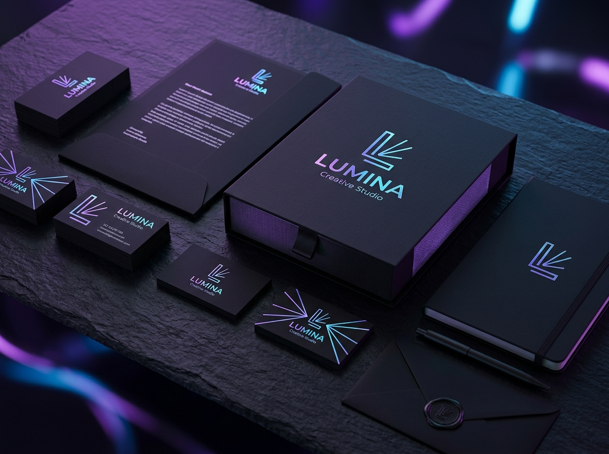

# Alex Morgan - Freelance Graphic Designer & Content Creator Portfolio

A modern, responsive, high-impact single-page portfolio website designed for a Freelance Graphic Designer, UI/UX Specialist, and Content Creator. Built with HTML5, Tailwind CSS, custom CSS animations, and modular JavaScript.



---

## ✨ Features

- **Modern Dark Aesthetic**: Deep obsidian slate background (`#070a13`), electric indigo/cyan glow gradients, and glassmorphic card elements.
- **Sticky Blur Navigation**: Sleek glass navbar with active section scrollspy and responsive mobile drawer.
- **High-Impact Hero Section**: Bold headline, 2-line intro, dynamic availability status, primary & secondary CTAs, and floating designer showcase badges.
- **About Me & Philosophy**: Detailed bio, 3 core pillars (Visual Identity, UI/UX Systems, Digital Media), and client proof metrics.
- **Interactive Skills & Tools Grid**: 5 specialized capability cards and 7 software badges (Figma, Photoshop, Illustrator, Premiere Pro, After Effects, Midjourney, Blender).
- **Filterable Portfolio Gallery**: Filter showcase projects seamlessly across `All`, `Branding`, `UI/UX`, and `Graphics & 3D`.
- **Project Detail Lightbox Modal**: High-res preview modal displaying project scope, tools used, client info, key deliverables, and impact metrics.
- **Functional Contact Form**: Clean form with validation, social links (YouTube, LinkedIn, GitHub, Behance, Dribbble, Instagram), and glowing toast notifications.
- **Performance & SEO Ready**: Semantic HTML5 markup, meta tags, Google Fonts, and lightweight CDN dependencies.

---

## 📁 File Structure

```
my-portfolio/
│
├── index.html           # Main single-page HTML structure
├── style.css            # Custom CSS animations, glassmorphism & glow effects
├── script.js            # Interactive logic (scrollspy, filter, modal, form validation)
├── README.md            # Documentation & deployment guide
│
└── assets/
    └── images/          # High-resolution portfolio case study graphics
        ├── project1.jpg # Lumina Creative Studio (Branding)
        ├── project2.jpg # Apex Crypto & SaaS (UI/UX)
        ├── project3.jpg # Neo-Chrome Static Series (Graphics)
        ├── project4.jpg # Vortex Creative AI (Branding)
        ├── project5.jpg # Nexus Mobile Studio (UI/UX)
        └── project6.jpg # Aetheria 3D Visuals (Graphics)
```

---

## 🚀 How to Publish to GitHub Pages

You can publish this portfolio to the web for free using **GitHub Pages** in just a few steps:

### Option 1: Using Git in Terminal / Command Prompt

1. Initialize git and commit your files:
   ```bash
   git init
   git add .
   git commit -m "Initial commit: Freelance Graphic Designer Portfolio"
   ```

2. Create a new repository on [GitHub](https://github.com/new) (e.g., `my-portfolio`).

3. Link your local repository to GitHub and push:
   ```bash
   git branch -M main
   git remote add origin https://github.com/<YOUR-USERNAME>/<YOUR-REPO-NAME>.git
   git push -u origin main
   ```

4. Enable GitHub Pages:
   - Go to your repository on GitHub.
   - Click on **Settings** > **Pages** (in the left sidebar).
   - Under **Build and deployment** > **Source**, choose **Deploy from a branch**.
   - Select **Branch**: `main` and folder `/ (root)`.
   - Click **Save**.

Your portfolio will be live at `https://<YOUR-USERNAME>.github.io/<YOUR-REPO-NAME>/` within 1-2 minutes!

---

## 🛠️ Customization Guide

- **Change Name & Bio**: Open `index.html` and edit the text inside the `<header>`, `#hero`, and `#about` sections.
- **Update Contact Email**: Change `alex@morganstudio.design` in `index.html` to your own email address.
- **Update Social Links**: Update the `href` attributes for YouTube, LinkedIn, Behance, GitHub, Dribbble, and Instagram in the `#contact` section of `index.html`.
- **Edit Portfolio Projects**: Open `script.js` and modify the `projectsData` object to update project descriptions, tools, and client metrics.
